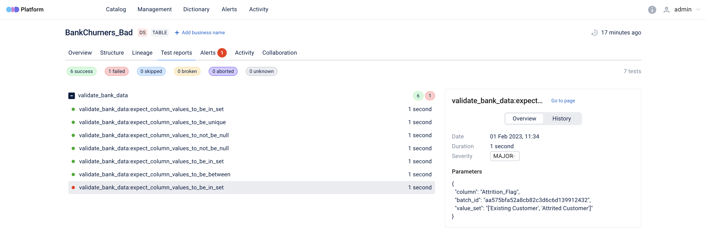

OpenDataDiscovery + Great Expectations = <3


___

This demo project shows ways OpenDataDiscovery works wits Data QA.


### Start OpenDataDiscovery Platform.
Run OpenDataDiscovery Platform and Postgres services to store Great Expectations results.
By default, OpenDataDiscovery is started on http://locahost:8080
```
docker compose up -d
```

### Install python libraries.
Next commands will create and activate virtual environment and install 3 libraries:

1. **great_expectations** - To work with GreatExpectations.
2. **odd-cli** - Has some useful commands,i.e. reading and collection local files metadata, creating OpenDataDiscovery tokens.
3. **odd-great-expectations** - Contains ODDAction to catch validation results, map them and send metadata to OpenDataDiscovery Platform.

```bash
python -m venv venv
source venv/bin/activate
pip install -r requirements.txt
```

### Create token.
Next command will create token with `name=data_qa` and print it in console.

```bash
odd tokens create data_qa -h http://localhost:8080      
```

### Store env variables
Store env variable to reduce duplicates commands CLI commands.
```bash
export ODD_PLATFORM_HOST=http://localhost:8080
export ODD_PLATFORM_TOKEN=<token_from_previous_step>
```

### Collect and ingest locals file's metadata.
For demo purposes we prepared 2 files `data/BankChurners.csv`, `data/BankChurners_Bad.csv`. 
Next CLI command will read files from `/data` folder, gather metadata and ingest it to OpenDataDiscovery Platform.
```bash
odd collect data     
```

### Run Great Expectations validations.
For demo purposes we prepared expectations (`/great_expectations/expectations/validate_bank_data.json`) and 2 checkpoints (`/great_expectations/checkpoints/*`) to run data quality tests against BankChurners files  
succeeded_checkpoint - Validates `data/BankChurners.csv` file.
```bash
great_expectations run succeeded_checkpoint
```
failed_checkpoint - Validates `data/BankChurners.csv` and `data/BankChurners_Bad.csv` files.
```bash
great_expectations run failed_checkpoint
```

### Got to OpenDataDiscovery UI.
Go to http://localhost:8080 to see results.
